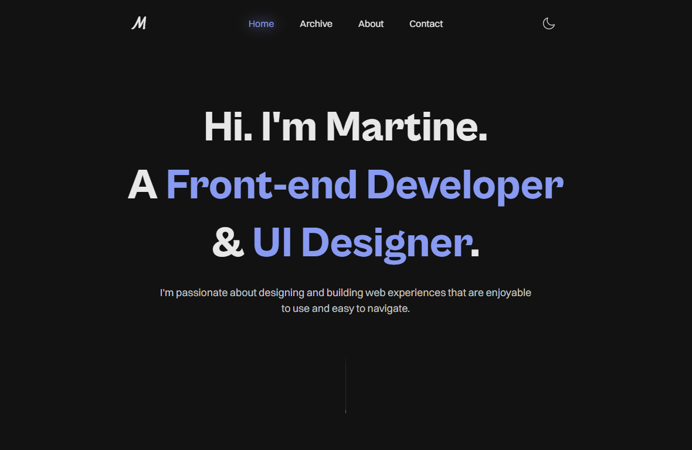
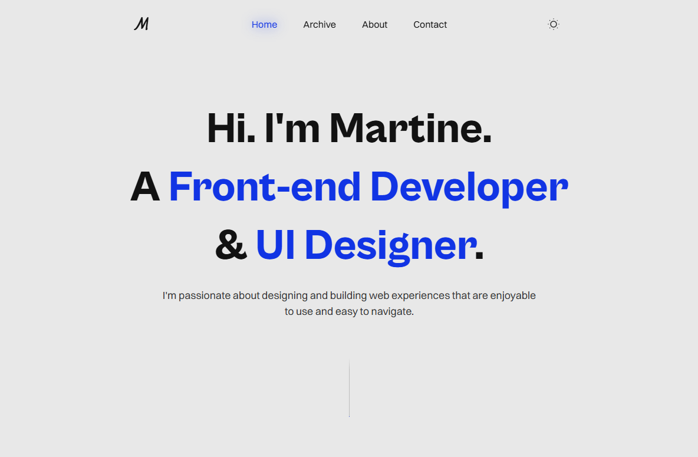

  

<h1 align="center">
  martineskorbakk.com - v2
</h1>

The second iteration of <a href="martineskorbakk.com" target="_blank">martineskorbakk.com</a> built with <a href="https://nextjs.org/" target="_blank">Next.js</a>, <a href="https://www.sanity.io/" target="_blank">Sanity.io</a> and hosted with <a href="https://vercel.com/ target="_blank">Vercel</a>

### Dark Mode

### Light Mode

